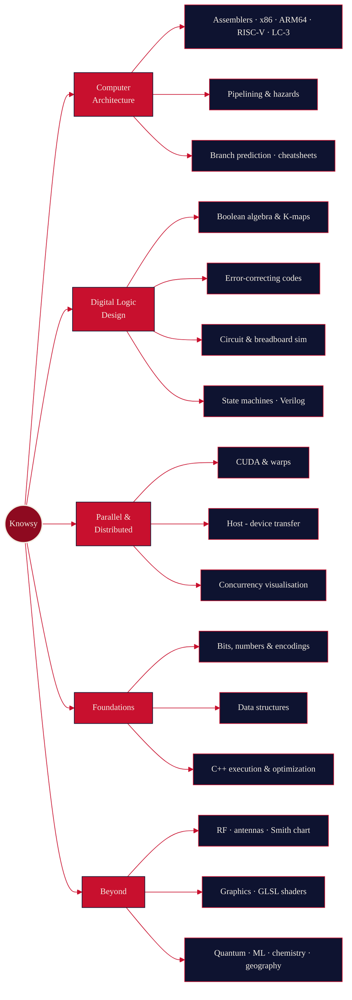
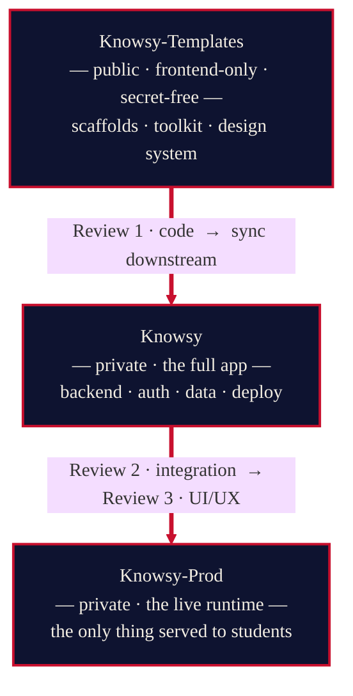

<!-- ─────────────────────────────  HERO  ───────────────────────────── -->

RUTGERS UNIVERSITY · RU-EDUCATIONAL​PLATFORM

# K N O W S Y

### *An interactive textbook, built at the speed of AI.*

 

 

Hands-on, in-browser learning objects for computer science & electrical engineering, and much more 
>*Lead Engineers **Satrajit Ghosh** & **Prof. Dov Kruger**.*

---

> [!NOTE]
> **How to read this page.** It's written to render on GitHub: the diagrams are
> live, and the ▸ triangles are **clickable** — expand the sections that matter to
> you. Skim the diagrams first, then open what you're curious about.

**[Mission](#-the-mission) · [Why](#-why-we-exist) · [Leadership](#-leadership--faculty) · [Pipeline](#-the-three-gate-pipeline) · [Repositories](#-the-repositories) · [The Projects](#-the-projects) · [Module Atlas](#-the-module-atlas) · [Class Platform](#-the-class-platform) · [IDoc](#-idoc--one-source-every-format) · [Contributing](#-how-a-contribution-travels) · [Design](#-the-design-language--editorial-academia)**

---

## ◆ The Mission

**Knowsy is an interactive textbook for the topics that are hard to learn from a
static page** — the ones that only click when you can *poke at them*. Instead of
reading about how a pipeline stalls, you watch hazards ripple through one. Instead
of memorizing a truth table, you minimize a Karnaugh map and see the gates fall
away. Instead of trusting that an assembler "just works," you step a program
through registers and memory, instruction by instruction.

Every piece is a small, self-contained **learning object** — a *widget* you can
open, manipulate, and learn from — and a full class platform wraps them into real
courses a professor can assign and grade. It spans the hardest-to-visualize corners
of computer science and electrical engineering: assembly execution, gate-level
logic, GPU parallelism, data structures, RF, graphics, and more.

---

## ◆ Why We Exist

Knowsy is a teaching tool **and** a research instrument. Three goals drive
everything:

<table>
<tr>
<td width="33%" valign="top">

### ① Test the limits of AI-assisted programming

We create many modules at high speed and watch *where AI accelerates the work
dramatically and where it doesn't*. It's a live testbed for hard questions: how
much does the prompter's experience matter? Do different domains benefit
differently? Can good process let a novice match an expert? And what happens to
what's *buildable* when the cost of software falls this far?

</td>
<td width="33%" valign="top">

### ② Rapid app development for professors

Give faculty a way to **collectively build a large library of visual,
interactive teaching objects** for their specific courses — and to do it in days,
not semesters. One shared toolkit, one shared design language, many hands.

</td>
<td width="33%" valign="top">

### ③ Teach undergraduates to build with AI

Give students **real, achievable tasks** on a real project — plus the strategies
to debug, the discipline to ship, and a concrete portfolio piece. A widget that's
hard for a sophomore to read is considered a *bug*.

</td>
</tr>
</table>

---

## ◆ Leadership & Faculty

**Lead developers — Satrajit Ghosh & Prof. Dov Kruger.** They own the
architecture and the engineering: the shared toolkit, the application, the design
system, the build pipeline, and the review at every gate. The core of Knowsy is
their code.

| Role | People | What they do |
|---|---|---|
| **Lead developers** | **Satrajit Ghosh** · **Prof. Dov Kruger** | Architect and engineer the platform end-to-end; write the core; own all three review gates. |
| **Curriculum faculty** | Dov Kruger · Maria Striki · Yulia Kumar | Define the subject matter and the learning objectives each module must hit. |
| **Contributors** | Rutgers student teams · AI coding agents | Build individual widgets on top of the core, under review. |

**Faculty domains:** Dov Kruger — Digital Logic Design, Computer Architecture,
assembler programming, parallel & distributed computing, algorithms, graphics ·
Maria Striki — Computer Architecture · Yulia Kumar — Quantum computing, Machine
Learning.

---

## ◆ The Three-Gate Pipeline

Knowsy's code moves through **three repositories, each guarding a different kind of
review.** Code is born in the open, hardened in private, and only then released.

| Gate | Repo | What happens here |
|:--:|---|---|
| **1** | **Knowsy-Templates** *(public)* | The contribution surface. Contributors fork it, build a widget from a scaffold, and open a PR; the lead developers review for **code quality**. Holds zero secrets by design. |
| **2** | **Knowsy** *(private)* | The complete application. Frontend mirrors in from Templates; backend, authentication, data, and deploy live only here. Reviewed for **integration**. |
| **3** | **Knowsy-Prod** *(private)* | The released runtime — the only deploy target. Reviewed for **UI/UX** before anything reaches a student. |

> *The split is the point: the public repo can stay safe to open to the world because
> nothing sensitive ever lives in it. Everything risky lives downstream.*

---

## ◆ The Repositories

| Repository | Visibility | Role |
|---|:--:|---|
| **Knowsy-Templates** | 🟢 public | Widget scaffolds, the shared frontend toolkit, the design system, and the guidance that contributors (human and AI) build against. Gate 1. |
| **Knowsy** | private | The full integration app — frontend + backend + auth + class platform. Gate 2. |
| **Knowsy-Prod** | private | The production runtime. Gate 3. |
| **Knowsy-Bots** | private | Workflow automation for the contributor experience (onboarding, scheduling). |
| **Idoc_codebase** | private | **IDoc** — a single-source document format for authoring articles *and* embedded interactive assessments. |

---

## ◆ The Projects

Knowsy isn't a single app — it's a growing library of **interactive learning
objects**, each a self-contained tool a student opens, manipulates, and learns from
in the browser. Here's what's actually being built, by pillar.

### ▸ Computer Architecture & Assembly

The flagship work. A family of **assembler simulators** — *x86, ARM64 (AArch64),
RISC-V, and LC-3* — that let a student type real assembly, run it, and
**single-step through execution**, watching registers, flags, memory, and the stack
change instruction by instruction. Breakpoints, ready-made example programs, and a
shared simulator chrome make all four instruction sets feel like one tool. Around
them: an **interactive pipeline visualizer** (instructions advancing through the
stages, where data and control **hazards** stall things, how forwarding and branch
strategies resolve them), a **branch-prediction explorer**, and concise *x86 /
RISC-V cheatsheets*.

### ▸ Digital Logic Design

Tools that make the gate level tangible: a **bits & numbers interpreter** that shows
one bit pattern at once as unsigned, two's-complement, float, and character; a
**Boolean-algebra & Karnaugh-map** workbench that turns a truth table into a
minimized circuit and shows the gates fall away; an **error-correcting-code lab**
(parity, CRC, custom encodings — corrupt a message and watch it get caught and
fixed); a **circuit simulator** and a **breadboard simulator** for wiring and
testing logic by hand; plus **state-machine** and **Verilog** material.

### ▸ Parallel & Distributed Computing

Visualizations for the things that are notoriously hard to picture: **CUDA warps**
and thread structure, **host↔device memory transfer** and VRAM, and
**concurrency** — making visible what actually happens when work runs in parallel.

### ▸ Foundations & Programming

A **C++ execution & optimization visualizer** that shows how source becomes
behavior (and what the optimizer does to it), **data-structure animations** —
balanced trees, ropes, and friends restructuring themselves live — and the bit and
number foundations everything else builds on.

### ▸ Specialized & Emerging

Breadth across the curriculum: **RF** tools (antenna radiation patterns, the Smith
chart), a **GLSL shader playground**, **map projections**, a **periodic table**,
**semiconductor structure**, **2D static equilibrium**, and **color-vision
screening**. **Quantum computing** and **Machine Learning** modules are on the
roadmap.

> *Every object runs entirely in the browser, mounts on its own page, and ships
> with a short instructions + help companion so a student is never staring at a
> blank canvas. New objects stay hidden until a lead reviewer deliberately promotes
> them to production.*

---

## ◆ The Module Atlas

Every learning object, by stage. Modules ride the same three-gate pipeline as the
code: built **in development**, promoted to **staged** for alpha/beta testing, then
**deployed** to production once they're ready for students.

### ● Deployed — live in production

| Module | Subject | What it does |
|---|---|---|
| **Solar System** | Astronomy | Fly between the planets in a live 3D scene with editorial info cards. |
| **Periodic Table** | Chemistry | All 118 elements — colour by property, animated electron shells, full dossiers. |
| **Color-vision screening** | Tests | Ishihara-style plate test; runs as the onboarding calibration gate. |

### ◐ Staged — alpha / beta testing

| Module | Subject | What it does |
|---|---|---|
| **Bits as Numbers** | Bits & gates | Read one bit pattern as binary, hex, and decimal at once. |
| **Bits as Characters** | Bits & gates | Watch a letter become bits across ASCII / UTF-8 / UTF-16 / UTF-32. |
| **Boolean algebra** | Bits & gates | Watch an expression collapse step-by-step under the laws. |
| **Karnaugh map** | Bits & gates | Drop minterms, watch the map group itself, read off the minimal form. |
| **Integer overflow** | Bits & gates | Number wheel, ripple-carry ladder, real disasters, wrap / saturate / trap. |
| **Floating point** | Bits & gates | Bit anatomy, the 0.1 lie, a log number line, broken associativity. |
| **Differential equations** | Mathematics | Type an ODE in LaTeX; get classification, steps, and a closed form. |
| **Parallel / SIMD Explorer** | Programming | Lane parallelism, cache lines, bitonic, FFT, Amdahl and the roofline. |
| **CMOS MOSFET gates** | Electronics | NOT / NAND / NOR / tristate — truth table, CMOS, and switch diagrams. |
| **2D Static Equilibrium** | Mechanics | Drop supports and loads on a beam; solve reactions, SFD, BMD. |
| **Structural systems** | Architecture | Force paths, material comparison, and a timeline of structural systems. |
| **Networking systems** | Networking | Topology and packets, spectrum coexistence, OSI, throughput vs range. |
| **Health systems** | Health | Evidence-first guide to nutrition, sleep, exercise, and source quality. |
| **Verb conjugation** | Languages | Conjugate any verb across nine languages — hover to hear, type to practice. |
| **World map projections** | Geography | Six switchable projections, click-to-identify, pinpoint challenges. |
| **Derivative calculator** | Tools | Differentiate symbolically with worked, step-by-step output. |

### ○ In development — in Knowsy, not yet promoted

| Module | Subject | What it does |
|---|---|---|
| **x86 Simulator** | Assembler | 16 GPRs, 16 YMM AVX2 lanes, System V calling, push / pop, memory inspector. |
| **RISC-V Simulator** | Assembler | 32 regs, x0 hard-zero, branches, jal / ret, ZNVC, memory inspector. |
| **AArch64 Simulator** | Assembler | 31 integer regs, 32 NEON vectors, AAPCS calling, live NZCV + call stack. |
| **LC-3 Simulator** | Assembler | Patt & Patel LC-3 — 16-bit words, NZP flags, decoded word at PC, hex memory. |
| **Error coding lab** | Bits & gates | Parity, Hamming(7,4), CRC — Venn SEC, step-through division, live verdict. |
| **C++ Execution & Optimization** | Programming | Execution model, RAII, folding, inlining, vectorization with live IR diff. |
| **Schematic Editor** | Electronics | ~30 parts, wire-draw, SVG + SPICE export, DC operating-point solver. |
| **Verilog Simulator** | Electronics | Editor, waveform viewer, resource estimates, FPGA targets, worked examples. |
| **Antenna radiation pattern** | RF | 10 archetypes, 2D polar + 3D dome, HPBW, directivity, sidelobes. |
| **Smith chart** | RF | Drag-on-chart load, S11 sweep, animated L-network match, full telemetry. |
| **Siege Engine Lab** | Mechanics | 10 siege weapons, 2D + 3D ballistics with drag, six scenarios. |
| **Semiconductor structure** | Materials | 7 materials, 3D lattice, band diagram, animated p-n junction, LED spectrum. |
| **Shader playground** | Graphics | Live GLSL bench with GPU printf, pixel time-travel, and reference diff. |
| **Probability Explorer** | Mathematics | Stream samples, watch histograms emerge, overlay theory; CLT / LLN demos. |
| **Linear Algebra Explorer** | Mathematics | Animate x↦Ax, elimination, LU / QR, eigen / SVD, least squares, PCA. |
| **Git / GitHub visualizer** | Tools | Two-computer clone / commit / push / pull / merge sim; load any public repo. |
| **Graphical Reference** | Reference | Process memory layout, stack frames, TCP handshake, CPU pipeline. |
| **Learning Data Structures** | Reference | Interactive textbook — arrays, lists, hash tables, BSTs, sorting. |
| **Command Reference** | Reference | Run real Unix commands in a sandbox with per-flag explanation. |

> *An animated, filterable version of this atlas exists as a standalone page
> (`knowsy-modules.html`) — open it in a browser for the interactive view. It can't
> live inside this README because GitHub strips the scripts and styles that make it
> move.*

---

## ◆ The Class Platform

A full class-management layer wraps the catalog so the learning objects become
**courses, not just demos**. A professor creates or **adopts a section** from a
pre-seeded catalog of ECE/CS courses, attaches the modules they want, and invites
students with a short join code. Each class then gets:

- **Assignments** — authored against the class's own modules, with due dates,
  rubrics, **live score preview** for students, **autograding** where it makes
  sense, optional **peer review**, and a teacher grading view.
- **A teaching dashboard** — a magazine-style overview of who submitted what,
  across every class a professor runs.
- **A shared calendar** — every member authors their own events: public or private,
  one-off or recurring, some **bookable** (office hours), with optional two-way sync
  to an external calendar.
- **Announcements & chat** — a posting board with pinnable banners and a live
  per-class conversation.
- **Live broadcast** — a cost-controlled, screen-only lecture stream for the
  big-hall, poor-sightlines case.

Roles are enforced end-to-end: students never see the authoring or grading
surfaces. Sign-in covers Google, Apple, Rutgers SSO, and email/password, and the
whole thing can be demoed locally with seeded users — no cloud account required.

---

## ◆ IDoc — One Source, Every Format

**IDoc** is an in-house document format designed to cover the
LaTeX / Markdown / PDF / Word ground with a single, consistent syntax — and, more
importantly, to let an author write a *lesson and its assessment from one source*.

<b>▸ What IDoc is for</b>

 

Write an article and the quizzes, fill-ins, code questions, and interactive
visualizations that go with it, all in one file — then render it anywhere. The
vision spans a browser render engine (interactive question widgets that drop into
any page or LMS), a professor-facing authoring tool with live preview, editor
highlighting across the popular code editors, and an experimental native
high-performance rendering path. It's the connective tissue between *writing*
course material and *running* it inside Knowsy.

> Status: a maturing format with a formal grammar, a spec, sample documents, and
> the beginnings of a toolchain. It was spun out of the Knowsy project into its own
> home so it can grow independently.

---

## ◆ How a Contribution Travels

The lead developers build and own the **core** — the toolkit, the application, the
pipeline. On top of that, **Rutgers student teams** contribute individual widgets,
with AI assistants as collaborators and every change passing through the leads'
review. The journey from "new face" to "shipped feature" is deliberately smooth:

<b>▸ The teams</b>

 

Contributors are organized into small, named teams (after the Greek pantheon —
*hera, iris, poseidon, zeus, demeter, athena, artemis, hephaestus, ares, apollo,
hermes, dionysus, hades, …*). Each team owns a task, expressed as a milestone, and
each person sits on exactly one team. The roster, the tasks, and the teams stay in
lockstep across the tools the project runs on.

 

### ◆

**Knowsy** — *Rutgers University · RU-EducationalPlatform*

Architected & engineered by **Satrajit Ghosh** and **Prof. Dov Kruger**.
Widgets contributed by Rutgers student teams. AI as a force multiplier.

Knowsy-Templates is open-source under the MIT License. The integration,
production, automation, and IDoc repositories are private.

 

*“Developed by engineers,Accelerated by AI.”*

